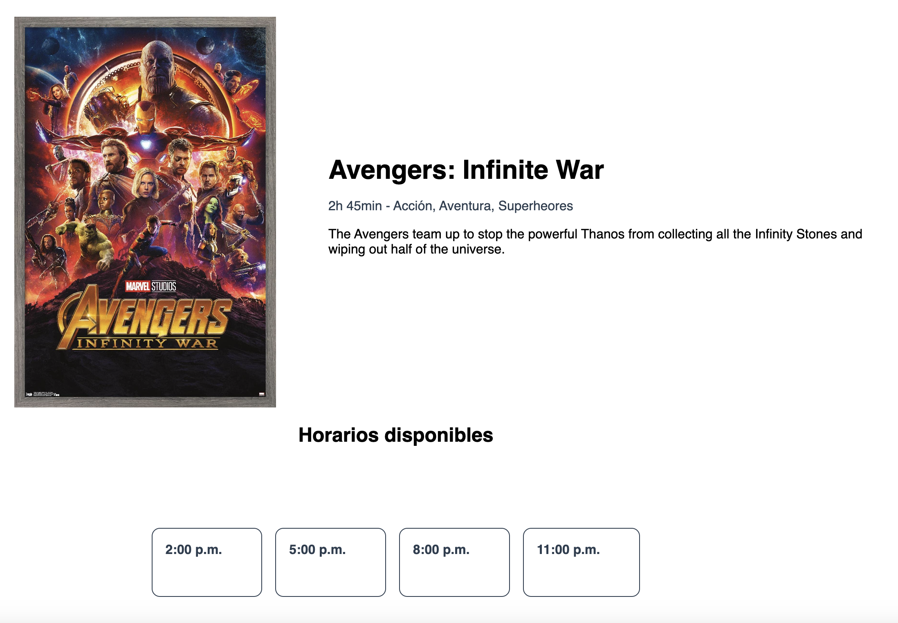
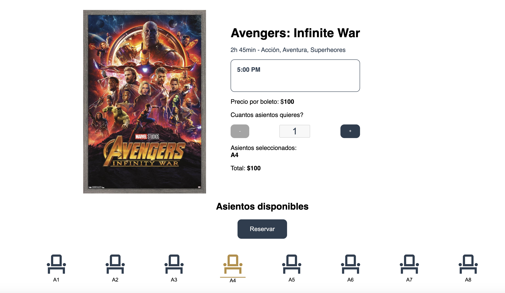

<div align="center">

# Sistema de Compra de Boletos de Cine 🎬 


Una aplicación para practicar la simulación de un sistema de compra de boletos de cine, desarrollada bajo la marca noeosorio.dev.


</div>

## 🚀 Descripción

El sistema de compra de boletos de cine es una aplicación web diseñada para simular el proceso de compra de boletos para películas. Esta aplicación permite a los usuarios seleccionar películas, elegir asientos y realizar compras ficticias de boletos.

## 🌟 Características

- **Selección de Películas**: Visualiza una lista de películas disponibles.
- **Elección de Asientos**: Selecciona tus asientos preferidos en el cine.
- **Compra de Boletos**: Simula la compra de boletos y genera un resumen de la compra.

## 📸 Capturas de Pantalla





## 💻 Tecnologías Utilizadas

- **HTML**
- **CSS**
- **JavaScript**

## ⚙️ Configuración del Proyecto

Para configurar y ejecutar este proyecto en tu entorno de desarrollo:

1. Clona el repositorio:
    ```bash
    git clone https://github.com/NoeOsorio/cinema.git
    ```
2. Navega al directorio del proyecto:
    ```bash
    cd cinema
    ```
3. Abre `index.html` en tu navegador para ver la aplicación en funcionamiento.

## 📝 Licencia

Este proyecto está licenciado bajo la Licencia MIT. Consulta el archivo [LICENSE](LICENSE) para más detalles.

## 🤝 Contribuir

Si deseas contribuir a este proyecto, te invitamos a realizar un pull request o enviar un correo a [business@noeosorio.com](mailto:business@noeosorio.com).

---

Desarrollado por [noeosorio.dev](https://noeosorio.com)
